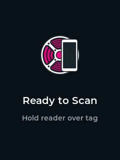
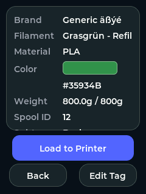
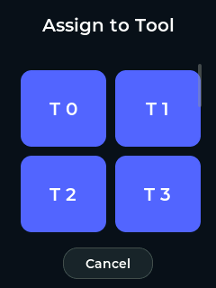
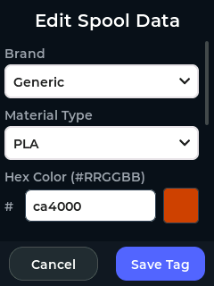

# CheapSpoolDisplay

CheapSpoolDisplay is a firmware project for the ESP32 Cheap Yellow Display (CYD) that is **dedicated to OpenSpool Tags**. It allows you to scan, view, and organize your 3D printer filament spools using the standardized OpenSpool NFC tag format.

 
 

## Features
- **NFC Tag Scanning**: Reads NTAG215/216 NFC tags formatted via the OpenSpool JSON specification using a connected MFRC522 SPI module.
- **Visual Interface**: Provides a modern, touch-friendly UI powered by LVGL to display the filament Brand, Type, Spool ID, and material color.
- **Spoolman Data Enrichment**: Optionally connect to a [Spoolman](https://github.com/Donkie/Spoolman) server to fetch real-time filament names and remaining weight (rounded to 0.1g).
- **Snapmaker U1 Integration**: Supports loading filament to a U1 printers with [Snapmaker U1 Extended Firmware](https://github.com/paxx12/SnapmakerU1-Extended-Firmware).
- **Webhook Integration**: Configure a target URL to send POST payloads directly from the device to load the spool to the printer. (Disabled if Snapmaker U1 Integration is enabled)

## Hardware Requirements
- **ESP32 Cheap Yellow Display (CYD)**
- **MFRC522 RFID SPI Module**

## Documentation
Please see the `docs/` folder for detailed guides:
- [Hardware Setup & modifications](docs/HARDWARE_SETUP.md)
- [Spoolman Integration Setup](docs/SPOOLMAN_SETUP.md)
- [Testing documentation](docs/TESTING.md)
- [Web Installer Development](docs/WEB_INSTALLER_DEV.md)

## Installation & Flashing

### Option 1: ESP Web Tools (Recommended)
You can flash the firmware and set up your Wi-Fi directly from your PC browser (Chrome/Edge)! 

1. Navigate to the online Web Installer: **[Launch CheapSpoolDisplay Web Installer](https://Rocka84.github.io/CheapSpoolDisplay)**
2. Follow the instrction in the Installer.
3. Once flashed, use the integrated **Serial Monitor** to configure the device (see [Post-Flash Configuration](#post-flash-configuration)).

### Option 2: PlatformIO
1. Clone this repository and open it in VSCode with PlatformIO installed.
2. Connect your CYD to your PC via USB.
3. Run the upload command: 
   ```bash
   pio run -t upload
   ```
4. Once the upload finishes, open the **Serial Monitor** (or run `pio device monitor`) to configure the device (see [Post-Flash Configuration](#post-flash-configuration)).

## Post-Flash Configuration
Regardless of how you flash, the device stores your settings in non-volatile memory (NVS). Type `help` in the Serial Terminal to see all available commands.

### 1. Set Credentials
Use the following commands to set your network and webhook details:
- `set wifi YourWiFiName YourWiFiPassword`
- `set webhook http://your-hook-url/webhook?spool={spool_id}&tool={toolhead}`
- `set spoolman http://your-spoolman-ip:8000`
- `set u1_host your-u1-ip:7125` (Enable Snapmaker U1 loading)
- `set tools 4` (Set number of tools from 1 to 6)
- `get config` (To verify)

> [!NOTE]
> Wi-Fi will only initialize if a **Webhook**, **Spoolman**, or **Snapmaker U1 Host** is set. If these fields are empty, the device remains offline.

### 2. Auto-Method Detection
The device automatically determines the HTTP method based on your Webhook URL:
- **GET Mode**: Triggered if the URL contains the `{spool_id}` placeholder (e.g. `http://api.com/load?spool={spool_id}`).
- **POST Mode**: Default mode. Sends a JSON payload: `{"spool_id": "...", "toolhead": X}`.

### 3. Snapmaker U1 Mode
If `u1_host` is configured, it **overrides** standard webhooks. The device sends a direct HTTP POST request to `/printer/filament_detect/set` using the **OpenSpool U1 Extended Format**. This integration is strictly for OpenSpool-formatted tags.
This requires the [Snapmaker U1 Extended Firmware](https://github.com/paxx12/SnapmakerU1-Extended-Firmware) (v1.1.1+ with PR #303 support) to be installed on the printer.

## Testing
We utilize automated unit tests through PlatformIO (`Unity`). For detailed info, check [TESTING.md](docs/TESTING.md).

To run the **Desktop unit tests** locally on your PC:
```bash
pio test -e desktop
```

To run the **Embedded integration tests** directly on the connected CYD:
```bash
pio test -e test_embedded
```

### UI Simulator (Desktop)
You can preview and test the LVGL interface directly on your computer for UI development and layout testing.
**Requirement**: [SDL2](https://www.libsdl.org/) installed on your system.
```bash
# Build and run the desktop simulator
pio run -e simulator
./simulator/program
```

## Credits
Huge parts of this project were developed by **Antigravity**, a powerful AI coding assistant, in collaboration with its human creator.
