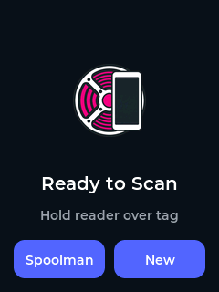
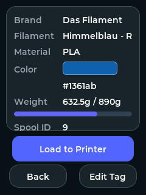
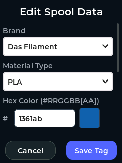
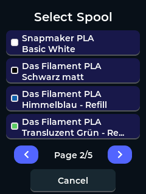

# CheapSpoolDisplay

CheapSpoolDisplay is a versatile firmware for the ESP32 Cheap Yellow Display (CYD) supporting **multiple tag standards** (OpenSpool, OpenPrintTag, OpenTag3D, Snapmaker). It allows you to scan, view, and organize your 3D printer filament spools using standardized formats. It also serves as an **external filament scanner** for the [SnapmakerU1-Extended-Firmware](https://github.com/paxx12/SnapmakerU1-Extended-Firmware).

    

## Quickstart
Follow the [Quickstart Guide](docs/QUICKSTART.md) to get your device flashed and configured.

## Features
- **Universal Tag Support**: 
  - Reads and writes all major filament tag standards: **OpenSpool (JSON)**, **OpenPrintTag (CBOR)**, and **OpenTag3D (Binary)**.
  - **Read-only support** for official **Snapmaker** proprietary tags.
  - Support for **NTAG215/216** (ISO14443A), **Mifare Classic 1K** (Snapmaker), and high-frequency **ICODE** (ISO15693) tags.
- **Flexible Tag Writing**: Edit spool data on-device and choose your preferred encoding format.
- **Visual Interface**: Provides a modern, touch-friendly UI powered by LVGL to display the filament Brand, Type, Spool ID, and material color.
- **Spoolman List Selection**: Paginate, browse, and load active spools directly from your Spoolman inventory without starting with an initial scan.
- **Spoolman Data Enrichment**: Optionally connect to a [Spoolman](https://github.com/Donkie/Spoolman) server to fetch real-time filament names and remaining weight (rounded to 0.1g).
- **Snapmaker U1 Integration**: Supports loading filament to a U1 printers with [Snapmaker U1 Extended Firmware](https://github.com/paxx12/SnapmakerU1-Extended-Firmware).
- **Webhook Integration**: Configure a target URL to send POST payloads directly from the device to load the spool to the printer. (Disabled if Snapmaker U1 Integration is enabled)

## Hardware Requirements
- **ESP32 Cheap Yellow Display (CYD)**
- **RFID Module**:
  - **MFRC522** (Standard ISO14443A support)
  - **PN5180** (Advanced ISO15693/ICODE support)

## 3D Printed Case
You can find a 3D printable case for this project inside the [cad/](./cad) directory:
- [Case Main](./cad/CheapSpoolDisplay%20-%20Case%20main.stl)
- [Case Lid](./cad/CheapSpoolDisplay%20-%20Case%20lid.stl)

[Source CAD on Onshape](https://cad.onshape.com/documents/a60add6f8ee1de5614ac75fe/w/16328b69bac76c64c87c96b5/e/ff77dffe6e5e288726fe3b2e)

## Documentation
See the [docs](./docs) folder or [online documentation](https://rocka84.github.io/CheapSpoolDisplay/docs.html)

## Installation & Flashing

### Option 1: ESP Web Tools (Recommended)
You can flash the firmware and set up your Wi-Fi directly from your PC browser (Chrome/Edge)! 

1. Navigate to the online Web Installer: **[Launch CheapSpoolDisplay Web Installer](https://Rocka84.github.io/CheapSpoolDisplay)**
2. Follow the instructions in the Installer.
3. Once flashed, use the integrated **Serial Terminal** to configure the device (see [Post-Flash Configuration](#post-flash-configuration)).

### Option 2: PlatformIO
1. Clone this repository.
2. Connect your CYD to your PC via USB.
3. Run the upload command in the terminal: 
   ```bash
   pio run -t upload
   ```
4. Run `pio device monitor` to configure the device (see [Post-Flash Configuration](#post-flash-configuration)).

## Post-Flash Configuration
The device stores settings in non-volatile memory (NVS). Type `help` in the Serial Terminal to see all available commands.

### 1. Settings
- `set wifi YourWiFiName YourWiFiPassword` (Set your WiFi credentials)
- `set webhook http://your-hook-url/webhook?spool={spool_id}&tool={toolhead}` (Set your webhook URL)
- `set spoolman http://your-spoolman-ip:8000` (Set your Spoolman URL)
- `set u1_host your-u1-ip:7125` (Enable Snapmaker U1 loading)
- `set tag_format <openspool|openprinttag|opentag3d|ask>` to set your preferred NFC format
- `set tools 4` (Set number of tools from 1 to 16)
- `get config` (To verify)

> [!NOTE]
> Wi-Fi will only initialize if a **Webhook**, **Spoolman**, or **Snapmaker U1 Host** is set. If these fields are empty, the device remains offline.

### 2. Webhook HTTP Method Detection
The device determines the HTTP method based on your Webhook URL:
- **GET Mode**: Triggered if the URL contains the `{spool_id}` placeholder (e.g. `http://api.com/load?spool={spool_id}`).
- **POST Mode**: Default mode. Sends a JSON payload: `{"spool_id": "...", "toolhead": X}`.

### 3. Snapmaker U1 Mode
If `u1_host` is configured, it **overrides** standard webhooks. The device sends a direct HTTP POST request to `/printer/filament_detect/set` using the **OpenSpool U1 Extended Format**.
This requires the [Snapmaker U1 Extended Firmware](https://github.com/paxx12/SnapmakerU1-Extended-Firmware) (v1.1.1+ with PR #303 support) to be installed on the printer.

### 4. Linking Proprietary Tags (Snapmaker)
Since official Snapmaker tags cannot be modified to store a Spoolman ID, you can link them to your Spoolman inventory using the **Lot Number** field:
1. Scan the Snapmaker tag.
2. Look up the "Lot Nr" in the extended info screen.
3. In Spoolman, set your spool's **Lot Number** to this value.
4. The device will now automatically find and sync with that Spoolman record whenever you scan the tag.

## Testing
We utilize automated unit tests through PlatformIO (`Unity`). For detailed info, check [TESTING.md](docs/TESTING.md).

To run the **Desktop unit tests** locally on your PC:
```bash
pio test -e desktop
```

To run the **Embedded integration tests** directly on the connected CYD:
```bash
pio test -e test_embedded
```

### UI Simulator (Desktop)
You can preview and test the LVGL interface directly on your computer for UI development and layout testing.
**Requirement**: [SDL2](https://www.libsdl.org/) installed on your system.
```bash
# Build and run the desktop simulator
pio run -e simulator
./simulator/program
```

## Credits
Huge parts of this project were developed by **Antigravity**, a powerful AI coding assistant, in collaboration with Rocka84.

## License
This project is licensed under the **MIT License**. See the [LICENSE](LICENSE) file for details.
