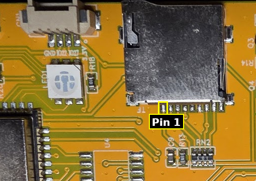
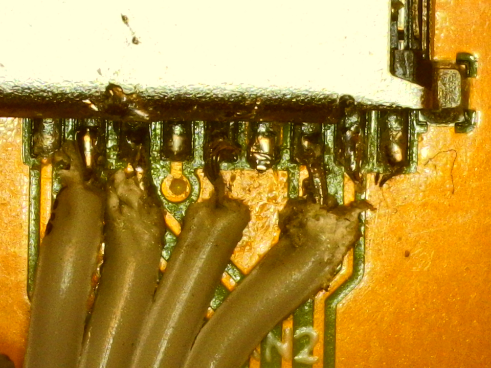

# Hardware Setup Guide

This document describes how to connect the MFRC522 RFID reader to the ESP32 Cheap Yellow Display (CYD) and details the hardware modifications required to support battery vs. USB power detection.

## 1. MFRC522 RFID Connection

The MFRC522 communicates via SPI. To keep the screen functional, we connect the reader to the **VSPI** bus, which is typically routed to the SD card slot on the CYD. By sacrificing the SD card slot, we can repurpose its pins.

Please wire your MFRC522 module to the CYD as follows:

| MFRC522 Pin   | CYD Pin (Connector)   | Location Description          |
| :------------ | :-------------------- | :-----------------------------|
| `3.3V`        | `3.3V`                | 3.3V rail                     |
| `RST`         | `IO22`                | Available on P3/CN1 connector |
| `GND`         | `GND`                 | Ground / 6th pin from left    |
| `SDA` (CS)    | `IO5`                 | 2nd pin from left             |
| `MOSI`        | `IO23`                | 3rd pin from left             |
| `SCK`         | `IO18`                | 5th pin from left             |
| `MISO`        | `IO19`                | 7th pin from left             |

*(Note: With the board oriented as shown in the image below, **Pin 1 is on the far left**.)*

I soldered tiny wires from a ribbon cable directly to the pins on the back of the CYD. I strongly recommend using a microscope to do this, as the pins are very small and close together. I also recommend tinning the wires before soldering to make it easier.

## 2. Power Detection & Battery Modification

> [!WARNING]
> The Power Management feature and Battery support are not yet implemented in the firmware!

Standard CYD boards do not have an onboard battery charging circuit or a dedicated way to detect if the board is powered via USB (5V) or an external battery.

To support the Power Management feature (which turns off the display on USB or enters deep sleep on battery after 60 seconds), you need to modify the board to allow the ESP32 to measure the incoming voltage.

### Voltage Divider Mod
The easiest approach to measure voltage without modifying the CYD board itself is to use **IO35**, which is purely an ADC input pin physically broken out on the CYD's **P3/CN1 external connector**.

1. **Wire a Voltage Divider** externally from the main power rail (V-In / 5V rail) to the `IO35` pin on the CYD connector:
   - Connect a `100kΩ` resistor from the main power rail (e.g. your battery/USB input junction) to `IO35`.
   - Connect a second `100kΩ` resistor from `IO35` to GND.
2. **How it works:** 
   - When powered by **USB (5V)**, the 100k/100k divider presents roughly `2.5V` to the `IO35` ADC pin.
   - When powered by a **Lithium Battery (3.7V - 4.2V)**, the voltage drops to roughly `1.85V - 2.1V`.
   - The `PowerManager` automatically reads the analog value on `IO35`. By comparing this voltage gap, it easily determines if you are docked to USB or running purely on the battery. With 100kΩ resistors, the phantom power draw is practically zero (just 25µA), greatly extending your device's deep sleep battery life!

### Waking from Deep Sleep
When running on battery power, the device will eventually enter **Deep Sleep** to conserve energy.
- **To wake up:** Press the physical `RST` (Reset) button located on the back or side of the CYD. This hardware interrupts the ESP32 and restarts the boot cycle, immediately jumping back to the Scanning interface.
